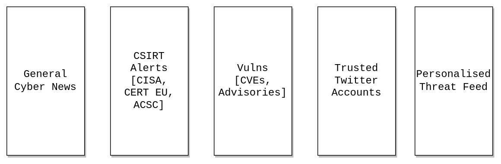

# Cyber TweetDeck

[TweetDeck](https://tweetdeck.twitter.com/) is a free service from Twitter that can be used to create an effective dashboard for all your cyber security operations, threat intel, and vulnerability alert needs. 

## Layout

This is a suggested layout that provides a multi panel view to cover multiple security issues that may affect your organisation. 

Additional panels can be added during incidents as well to track ongoing and actively exploited vulnerabilities or other security issues.

## Resources

* [Twitter search operators](https://developer.twitter.com/en/docs/twitter-api/v1/rules-and-filtering/search-operators)
* [Twitter lists](https://help.twitter.com/en/using-twitter/twitter-lists) - A good way to create shareable lists with the accounts you'd like to be alerted on.

### Misc

* [Better TW](https://better.tw/) - If you want to enhance TweetDeck, this addon has some neat options namely muting tweaks using regex.
